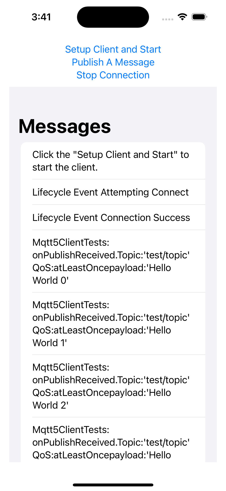

# iOS X509Connect Sample

[**Return to main sample list**](./README.md)

This sample uses the
[Message Broker](https://docs.aws.amazon.com/iot/latest/developerguide/iot-message-broker.html)
for AWS IoT to send and receive messages through an MQTT connection.

On startup, the device connects to the server, subscribes to a topic, and begins publishing messages to that topic. The device should receive those same messages back from the message broker, since it is subscribed to that same topic. Status updates are continually printed to the console. This sample demonstrates how to send and receive messages on designated IoT Core topics, an essential task that is the backbone of many IoT applications that need to send data over the internet. This sample simply subscribes and publishes to a topic, printing the messages it just sent as it is received from AWS IoT Core, but this can be used as a reference point for more complex Pub-Sub applications.

## Before running the sample

### Setup an AWS Account
If you do not have an AWS account, complete [these steps](https://docs.aws.amazon.com/iot/latest/developerguide/setting-up.html) to create one. This will provide you an account specific endpoint.

### Understand IoT
The [What is AWS IoT](https://docs.aws.amazon.com/iot/latest/developerguide/what-is-aws-iot.html) developer guide will help you understand IoT.

### Prepare your IoT Thing certificates
While you create an IoT thing, please download the certificate files into `X509Connect\MqttClient` folder. Save the certificate files as `.\X509Connect\MqttClient\cert.pem`, and the private key file as `.\X509Connect\MqttClient\privatekey.pem`.

## How to run the sample (with XCode)
1. Launch the `X509Connect\MqttClient.xcodeproject` with XCode
2. Setup your endpoint in `X509Connect\MqttClient\ContentView.swift`: Replace "<your-endpoint>" in the source with your IoT endpoint value.
```
let TEST_HOST = "<your-endpoint>"
```
3. Run the project. You should see the the following screen



4. Click "Setup Client and Start" to start connection

## Trouble Shoot
### Enable logging in samples

To enable logging in the samples, you need add the following line into the code. The logger level has the following options: `trace`, `debug`, `info`, `warn`, `error`, `fatal`, or `none`.
```swift
// Optional init debug log to help with debugging.
Logger.initialize(target: .standardOutput, level: .debug)
```
### I'm getting Error code 5134: AWS_ERROR_MQTT_UNEXPECTED_HANGUP
This error is most likely due to your IoT Core Thing's [Policy](https://docs.aws.amazon.com/iot/latest/developerguide/iot-policies.html) must provide privileges for this sample to connect. Below is a sample policy that can be used on your IoT Core Thing that will allow this sample to run as intended.

For the purposes of this sample, please make sure your policy allows a client ID of `test-*` to connect or use the `--client_id <client ID here>` argument when running the sample to use a client ID your policy supports.

<details>
<summary>(see sample policy)</summary>

```
{
      "Version": "2012-10-17",
      "Statement": [
        {
          "Effect": "Allow",
          "Action": [
            "iot:Publish",
            "iot:Receive"
          ],
          "Resource": [
            "arn:aws:iot:<b>region</b>:<b>account</b>:topic/test/topic"
          ]
        },
        {
          "Effect": "Allow",
          "Action": [
            "iot:Subscribe"
          ],
          "Resource": [
            "arn:aws:iot:<b>region</b>:<b>account</b>:topicfilter/test/topic"
          ]
        },
        {
          "Effect": "Allow",
          "Action": [
            "iot:Connect"
          ],
          "Resource": [
            "arn:aws:iot:<b>region</b>:<b>account</b>:client/test-*"
          ]
        }
      ]
    }
```

  Replace with the following with the data from your AWS account:
  * `<region>`: The AWS IoT Core region where you created your AWS IoT Core thing you wish to use with this sample. For example`us-east-1`.
  * `<account>`: Your AWS IoT Core account ID. This is the set of numbers in the top right next to your AWS account name whenusing the AWS IoT Core website.

  Note that in a real application, you may want to avoid the use of wildcards in your ClientID or use them selectively. Please follow best practices when working with AWS on production applications using the SDK.

</details>


### Others
Please make sure to check out our resources too before opening an DISCUSSION:
* [FAQ](../../../Documentation/FAQ.md)
* [MQTT5 User Guide](../../../Documentation/MQTT5_Userguide.md)
* [IoT Guide](https://docs.aws.amazon.com/iot/latest/developerguide/what-is-aws-iot.html)
* [Check for similar issues](https://github.com/aws/aws-iot-device-sdk-swift/issues)
* [AWS IoT Core Documentation](https://docs.aws.amazon.com/iot/)
* [Dev Blog](https://aws.amazon.com/blogs/?awsf.blog-master-iot=category-internet-of-things%23amazon-freertos%7Ccategory-internet-of-things%23aws-greengrass%7Ccategory-internet-of-things%23aws-iot-analytics%7Ccategory-internet-of-things%23aws-iot-button%7Ccategory-internet-of-things%23aws-iot-device-defender%7Ccategory-internet-of-things%23aws-iot-device-management%7Ccategory-internet-of-things%23aws-iot-platform)

