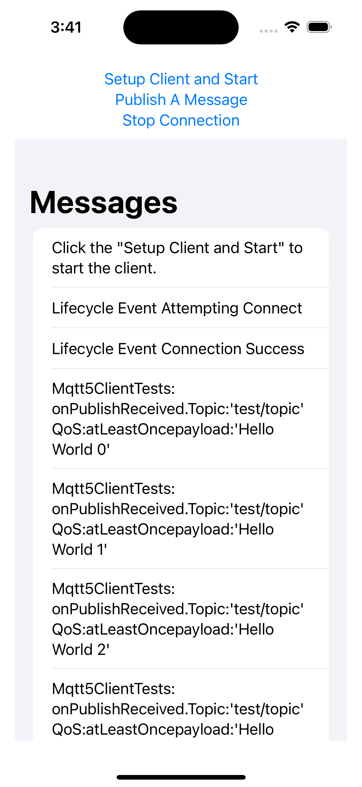

# iOS PubSub Sample

[**Return to main sample list**](./README.md)

This sample uses the
[Message Broker](https://docs.aws.amazon.com/iot/latest/developerguide/iot-message-broker.html)
for AWS IoT to send and receive messages through an MQTT connection.

This sample demonstrates how to send and receive messages on designated IoT Core topics. The sample would perform the following actions: 
1. Initializes the Device SDK library
2. Sets up the MQTT 5 Client
3. Starts the connection session
4. Subscribe to test topics
5. Publish to test topics
4. Stops the connection session

## Before Running the Sample

### Setup an AWS Account:
If you don't have an AWS account, complete [these steps](https://docs.aws.amazon.com/iot/latest/developerguide/setting-up.html) to create one. This will provide you with an account specific endpoint.

### Understand IoT:
The [What is AWS IoT](https://docs.aws.amazon.com/iot/latest/developerguide/what-is-aws-iot.html) developer guide will help you understand IoT.

### Prepare your IoT Thing certificates
While you create an IoT thing, please download the certificate files into `iOSPubSubSample\MqttClient` folder. Save the certificate files as `.\iOSPubSubSample\MqttClient\cert.pem`, and the private key file as `.\iOSPubSubSample\MqttClient\privatekey.pem`.

## How to run the sample (with XCode)
1. Launch the `iOSPubSubSample\MqttClient.xcodeproject` with XCode
2. Setup your endpoint in `iOSPubSubSample\MqttClient\ContentView.swift`: Replace "<your-endpoint>" in the source with your IoT endpoint value.
```
let TEST_HOST = "<your-endpoint>"
```
3. Run the project. You should see the the following screen



4. Test the operation: 

* Click "Setup Client and Start" to start a connection session. 
* Click "Publish A Message" to send a publish message.
* Click "Stop Connection" to stop a connection session. 

## Troubleshooting
### Enable logging in samples

To enable logging in the samples, you must add the following line *after* initializing `IotDeviceSdk`. The logger level has the following options: `trace`, `debug`, `info`, `warn`, `error`, `fatal`, or `none`.
```swift
// The IoT Device SDK must be initialized before it is used.
IotDeviceSdk.initialize();

// This will turn on SDK and underlying CRT logging to assist in troubleshooting.
try Logger.initialize(target: .standardOutput, level: .debug)
```
### I'm getting error code 5134: AWS_ERROR_MQTT_UNEXPECTED_HANGUP
This error is most likely due to your AWS IoT Core thing's [policy](https://docs.aws.amazon.com/iot/latest/developerguide/iot-policies.html). The policy must provide privileges for this sample to connect. The following is a sample policy that can be used on your AWS IoT Core thing that allows this sample to run as intended.

For the purposes of this sample, make sure your policy allows a client ID of `test-*` to connect or use the `--client_id <client ID here>` argument to use a client ID that your policy supports.

<details>
<summary>(see sample policy)</summary>

```
{
  "Version": "2012-10-17",
  "Statement": [
    {
      "Effect": "Allow",
      "Action": [
        "iot:Connect"
      ],
      "Resource": [
        "arn:aws:iot:<b>region</b>:<b>account</b>:client/test-*"
      ]
    }
  ]
}
```

  Replace the following with the data from your AWS account:
  * `<region>`: The AWS Region where you created the AWS IoT Core thing you wish to use with this sample. For example, `us-east-1`. For more information, see [AWS IoT Core endpoints](https://docs.aws.amazon.com/general/latest/gr/iot-core.html).
  * `<account>`: Your AWS account ID. For more information, see [View AWS account identifiers](https://docs.aws.amazon.com/accounts/latest/reference/manage-acct-identifiers.html)

  Note: In a real application, you might want to avoid the use of wildcards in your policy or use them selectively. Follow best practices when using the SDK to work with AWS on production applications.

</details>

### Other Resources
Check out our resources to learn more:
* [FAQ](../../../Documentation/FAQ.md)
* [MQTT 5 User Guide](../../../Documentation/MQTT5_Userguide.md)
* [What is AWS IOT?](https://docs.aws.amazon.com/iot/latest/developerguide/what-is-aws-iot.html)
* [Check for similar issues](https://github.com/aws/aws-iot-device-sdk-swift/issues)
* [AWS IoT Core Documentation](https://docs.aws.amazon.com/iot/)
* [Dev Blog](https://aws.amazon.com/blogs/?awsf.blog-master-iot=category-internet-of-things%23amazon-freertos%7Ccategory-internet-of-things%23aws-greengrass%7Ccategory-internet-of-things%23aws-iot-analytics%7Ccategory-internet-of-things%23aws-iot-button%7Ccategory-internet-of-things%23aws-iot-device-defender%7Ccategory-internet-of-things%23aws-iot-device-management%7Ccategory-internet-of-things%23aws-iot-platform)
